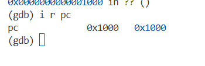
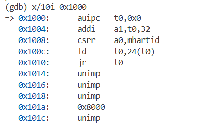
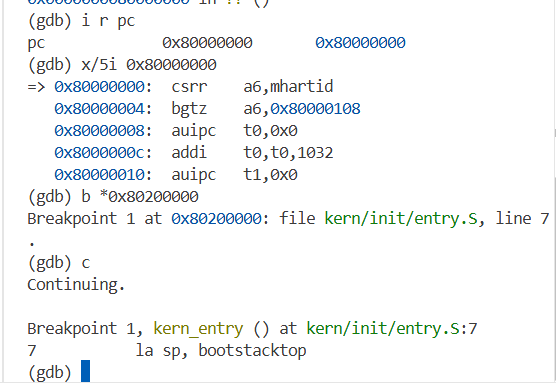
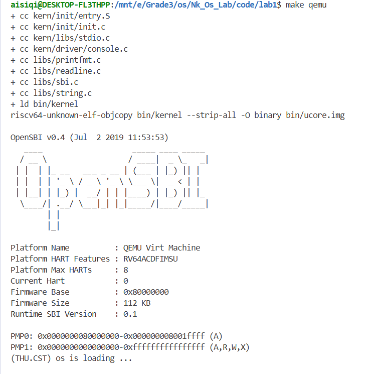
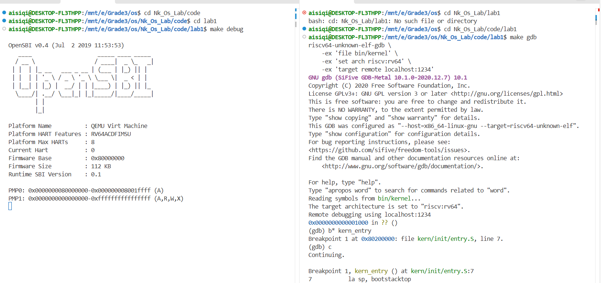
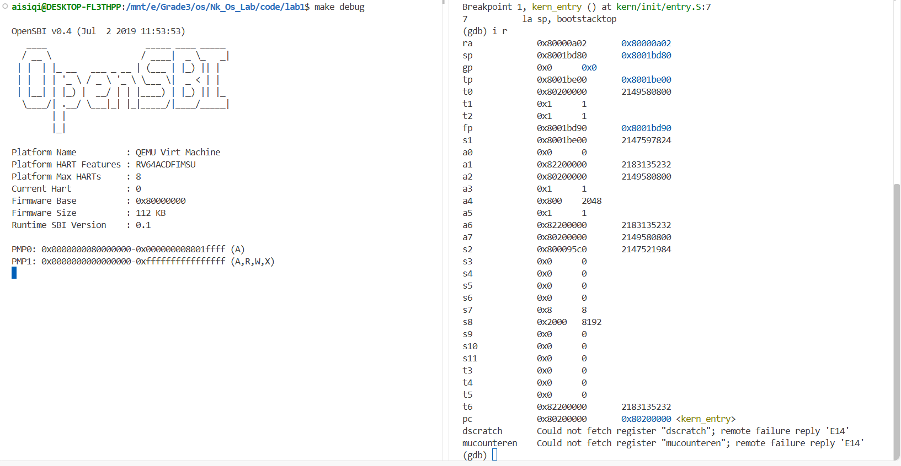

# 操作系统实验报告

## 实验基本信息

| 项目 | 内容 |
|------|------|
| **实验名称** | Lab 1: [ 比麻雀更小的麻雀（最小可执行内核）] |
| **小组成员** | 2410796-艾思奇、2412806-阳雨洁 |
| **完成日期** | 2026-10-08 |

### 小组分工

| 成员 | 负责的练习/模块 |
|------|----------------|
| 2410796-艾思奇 | [练习2，实验调试] |
| 2412806-阳雨洁 | [练习1，实验整体逻辑分析] |

---

## 一、实验目的

<!-- 说明本次实验的主要目标和预期成果 -->

本实验的主要目的是：

1. [目的1：理解用户态进程如何通过系统调用进入内核]
2. [目的2：学习使用 AI 辅助开发操作系统核心功能]

---

## 二、实验环境

你们使用的 AI 工具

| 成员 | AI 编程工具 | 底层模型 | 备注 |
|------|------------|---------|------|
| 2410796-艾思奇 | vscode的codex插件 | [DeepSeek-V4-Flash] | 无 |
| 2412806-阳雨洁 |vscode的codex插件 | [DeepSeek-V4-Flash] | 无

**说明：**
- **AI 编程工具**：指具体使用的终端工具、编辑器插件、桌面应用或浏览器界面
- **底层模型**：指该工具使用的大语言模型及版本

---

## 三、实验整体逻辑分析

### 2.1 本章节的逻辑主线

本章实验围绕“最小可执行内核”的启动过程展开，核心问题是：一个操作系统内核如何从机器加电开始，经过固件（OpenSBI）的引导，被加载到内存的指定位置，并最终执行到 C 语言编写的内核初始化函数？

具体来说，本章要解决以下几个关键问题：

    计算机启动时，谁负责把操作系统内核加载到内存？
    —— 由 QEMU 自带的 bootloader（OpenSBI 固件）完成。OpenSBI 运行在 RISC-V 的最高特权级 M-mode，负责初始化硬件环境，并将内核镜像加载到物理地址 0x80200000。

    内核镜像应该被加载到哪里？为什么是 0x80200000？
    —— 这由链接脚本 kernel.ld 指定。内核代码是地址相关的，必须加载到链接时确定的地址，才能正确执行。OpenSBI 与内核约定好内核入口在 0x80200000。

    内核的第一条指令在哪里？它做了什么？
    —— 内核的第一条指令位于 kern/init/entry.S 的 kern_entry 标签处。它首先设置内核栈指针（la sp, bootstacktop），然后通过尾调用（tail kern_init）跳转到 C 语言入口 kern_init()。

    如何验证整个启动流程确实按预期执行？
    —— 使用 GDB 调试，观察 PC 的变化：从 0x1000 → 0x80000000（OpenSBI）→ 0x80200000（内核入口），并确认最终执行到 entry.S 和 kern_init()。

因此，本章的逻辑主线可以概括为：从硬件复位到操作系统内核 C 入口的完整启动链路，涉及固件、特权级、内存布局、链接脚本、ELF/bin 格式、汇编与 C 的衔接等基础但核心的概念。

### 2.2 功能的逐步实现

本章实验按照“理解整体流程 → 设置内存布局与入口 → 实现汇编到 C 的跳转 → 封装输出 → 调试验证”的顺序逐步推进：

    1.首先理解项目组成和完整启动流程

        通过阅读实验文档和项目目录，明确 kern/init/entry.S、kern/init/init.c、tools/kernel.ld、Makefile 等文件的作用。

        梳理出从加电复位 → MROM → OpenSBI → 内核入口 → kern_init() 的完整执行流。

        为什么先做这个？ 因为只有先建立全局视角，才能理解后续每个文件存在的意义。

   2. 接着设置内核的内存布局和入口点

        通过链接脚本 kernel.ld 指定内核加载地址为 0x80200000，并确保 entry.S 的代码段位于内核镜像的最开始位置。

        为什么接着做这个？ 因为 OpenSBI 会跳转到 0x80200000，如果内核没有正确链接到这个地址，第一条指令就会执行错误代码，启动必然失败。

    3.然后实现从汇编入口到 C 语言入口的跳转

        在 entry.S 中编写 kern_entry：先用 la sp, bootstacktop 建立内核栈，再用 tail kern_init 跳转到 C 函数 kern_init()。

        为什么然后做这个？ 因为 C 语言函数需要栈环境才能运行，而汇编是进入 C 世界的桥梁。没有这一步，内核无法执行任何有意义的 C 代码。

    4.之后通过 OpenSBI 封装输入输出函数

        在 libs/sbi.c 和 libs/sbi.h 中封装 SBI 调用，使内核可以通过 cprintf() 等函数向控制台输出信息。

        为什么之后做这个？ 因为内核启动成功后需要输出提示信息，而输出功能依赖 OpenSBI 提供的 M-mode 服务。这是验证启动成功最直观的方式。

    5.最后使用 GDB 验证启动流程

        在 QEMU 中启动 GDB 调试，观察 PC 从 0x1000 到 0x80000000 再到 0x80200000 的变化，并在 entry.S 处设置断点，确认内核栈设置和跳转正确。

        前面的代码是否正确，必须通过实际调试来验证。GDB 让我们能够“看到”启动过程的每一步，形成闭环。

通过以上步骤，最终实现了一个能够被 OpenSBI 正确加载、从汇编入口进入 C 函数、并成功输出信息的最小可执行内核。

---

### 练习：[练习一：理解内核启动中的程序入口操作]

**负责人：** [2412806-阳雨洁]
一、la sp, bootstacktop
1. 指令含义

la 是 RISC-V 汇编中的伪指令，全称 Load Address，作用是把某个符号的地址加载到寄存器中。

这里的

la sp, bootstacktop

等价于：

sp = &bootstacktop

也就是把符号 bootstacktop 的地址装入栈指针寄存器 sp。
2. bootstack 和 bootstacktop

代码后面定义了：

.section .data
    .align PGSHIFT
    .global bootstack
bootstack:
    .space KSTACKSIZE
    .global bootstacktop
bootstacktop:

.section .data：把下面的内容放到数据段。

.align PGSHIFT：按页大小对齐，通常 PGSHIFT = 12，即 4KB 对齐。

bootstack:：定义一个符号，表示内核栈的起始地址（低地址端）。

.space KSTACKSIZE：预留 KSTACKSIZE 大小的空间，作为内核栈。

bootstacktop:：紧跟在预留空间之后，表示内核栈的顶部（高地址端）。

因为 RISC-V 的栈是向下增长的，所以栈指针 sp 应该指向栈的最高地址。
因此，la sp, bootstacktop 就是让 sp 指向这块内核栈的顶部。
3. 完成了什么操作

执行这条指令后：

    sp 被设置为 bootstacktop 的地址。

    内核拥有了一个合法、可用的栈。

    栈空间范围是 bootstack 到 bootstacktop，大小是 KSTACKSIZE。

4. 目的是什么

目的：为 C 语言函数调用准备栈环境。

在 entry.S 之前，CPU 刚从 OpenSBI 跳转过来，并没有为内核建立自己的栈。
C 语言函数运行时需要栈来：保存局部变量；保存返回地址；保存调用者寄存器；传递参数等。

如果没有设置 sp，后续调用 C 函数 kern_init() 时就会使用一个无效的栈指针，导致程序崩溃。

二、tail kern_init
1. 指令含义

tail 是 RISC-V 汇编中的伪指令，用于实现尾调用。
它通常会被展开为：

auipc t1, %pcrel_hi(kern_init)
jalr x0, t1, %pcrel_lo(kern_init)

效果是：跳转到 kern_init 函数，但不保存返回地址。

与 call kern_init 不同：

    call 会把返回地址保存到 ra 寄存器；

    tail 不保存返回地址，因为它假设不需要返回。

2. 完成了什么操作

执行这条指令后：

    CPU 的 PC 跳转到 kern_init 函数的入口地址。

    开始执行 C 语言编写的内核初始化函数 kern_init()。

    不会在 ra 中留下返回地址，也不建立新的栈帧。

3. 目的是什么

目的：从汇编入口跳转到 C 语言内核初始化函数，正式进入 C 代码执行阶段。

kern_init() 是 C 语言编写的内核入口点，定义在 kern/init/init.c 中。
它会完成后续初始化工作，并最终调用 cprintf() 输出一行信息，表示内核启动成功。

使用 tail 而不是 call 的原因：

    kern_init() 是内核初始化的终点式入口，不需要返回到 entry.S。

    不保存返回地址可以避免在栈上压入无用的返回地址，保持启动流程简洁。

    尾调用不会建立新的栈帧，符合启动阶段“一次性进入 C 代码”的语义。

三、结合整体启动流程

把这两条指令放回完整流程中：

加电复位
→ CPU 从 0x1000 进入 MROM
→ 跳转到 0x80000000 执行 OpenSBI
→ OpenSBI 初始化，并把内核加载到 0x80200000
→ 跳转到 0x80200000，开始执行 kern_entry
→ la sp, bootstacktop      # 建立内核栈
→ tail kern_init           # 跳转到 C 函数 kern_init
→ kern_init() 调用 cprintf() 输出信息
→ 内核启动成功

所以：

    la sp, bootstacktop 完成了内核栈的建立，目的是让 C 函数有栈可用。

    tail kern_init 完成了从汇编到 C 的跳转，目的是进入内核初始化函数，开始执行 C 代码。

### 练习：[练习二：使用GDB验证启动流程]

**负责人：** [2410796-艾思奇]

[按照练习的具体要求进行解答]
首先进行调试，为了找到一开始的指令在哪，我们先启动gdb调试，直接查看pc指向哪里，随后发现如我们期待的那样指向了0x1000.

然后我们看看入口处的10条指令都是什么：

第一条是储存现在的pc值，后面两条询问ai得知是为了初始化设备树和coreid，然后把我们接下来要前往的固件地址加载到t0,这里1000+24恰好是0x1018，不过因为反汇编的关系显示的不是很完美，但无伤大雅

之后我们跳到了80000000处，这里的代码大多都是opensbi进行初始化，然后我们在0x80200000打上断点，继续执行，最终成功执行到了初始栈的部分，调试完毕：

**结论**：最初几条指令在 0x1000，按 RISC-V 启动约定准备好参数（a0 = hartid，a1 = DTB 地址），然后跳到烧在 0x1018 处的固件入口地址（0x80000000）之后 OpenSBI 在 M 模式里完成：PMP 内存保护设置、异常委托、准备 S 模式环境，最后按约定跳到 next stage 地址 0x80200000，最后c函数进行初始化栈等操作，启动内核。
---

---

## 四、测试与验证

<!-- 根据该实验的具体情况，提供完整的测试运行截图，应包含：
- 编译及运行成功的输出（make qemu），可能有多个
- 测试通过的结果（make grade），只有一个
-->

**测试截图：**

---

---

## 五、实验总结与收获

### 对操作系统的理解

1.OpenSBI / bootloader 对应操作系统引导。固件负责把内核加载到指定地址，角色类似 BIOS/UEFI，只是平台和实现不同。

2.RISC-V 特权级 M/S/U 对应内核态与用户态。本实验具体展示了三级特权，OS 原理中的抽象概念在这里落地。

3.链接脚本指定加载地址 对应地址空间布局。内核代码是地址相关的，必须加载到 0x80200000，本实验尚未涉及虚拟内存。

4.la sp, bootstacktop 设置内核栈 对应函数调用栈。为 C 函数准备栈环境，是栈机制在启动阶段的应用。

5.tail kern_init 跳转到 C 对应内核入口。汇编完成底层设置后进入 C，尾调用不保存返回地址。

6.SBI 调用与 cprintf 对应系统调用 / 设备管理。内核通过 SBI 请求固件输出，类似系统调用但方向相反。

7.ELF 与 bin 格式 对应可执行文件加载。ELF 含调试和段信息，bin 是扁平二进制，OpenSBI 加载的是 bin。

### AI 协作开发的经验

在分析实验逻辑时，我们与 AI 讨论“为什么要先设置栈”“为什么用 tail 而不是 call”，AI 能够从 RISC-V 调用约定和启动语义角度给出解释，帮助我们深化理解。

---

